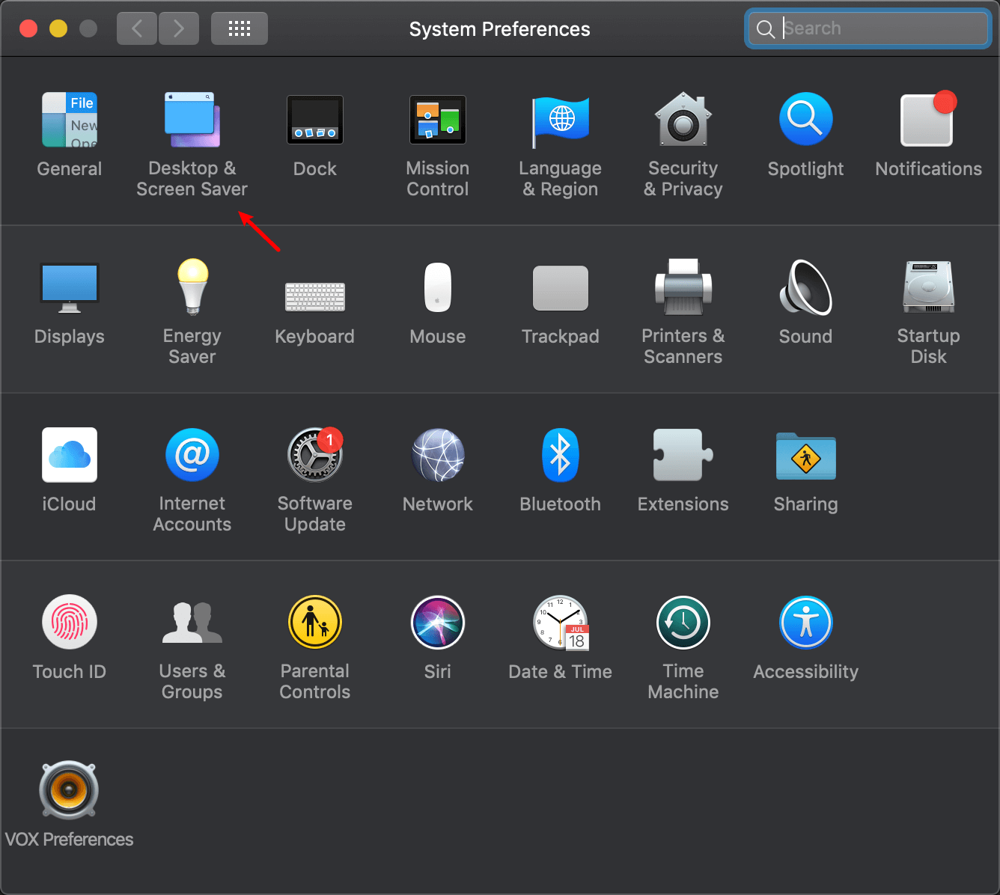
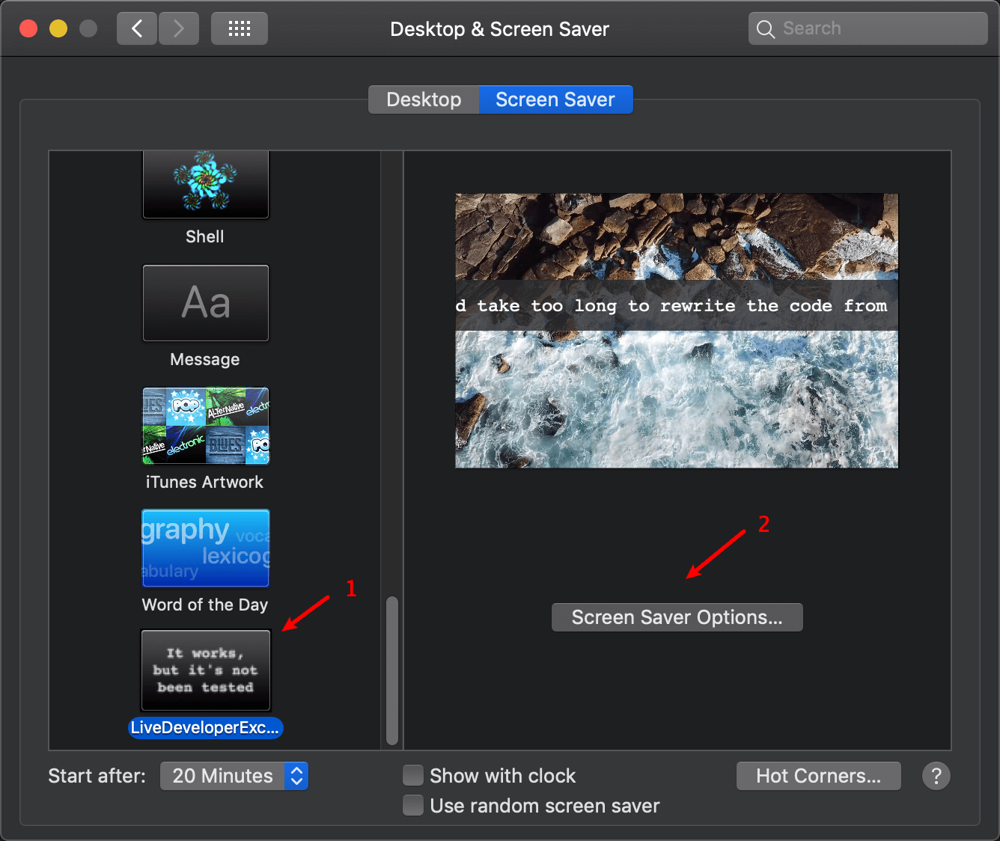
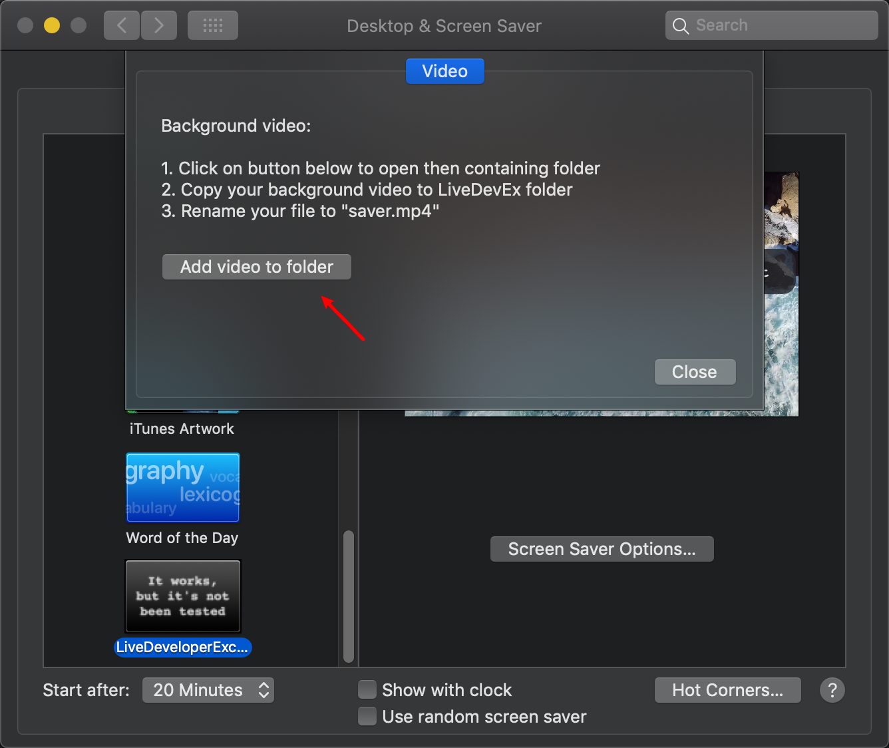
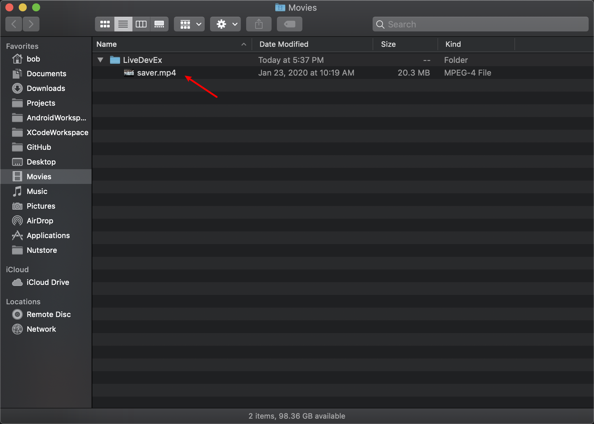

# LiveDeveloperExcuses.saver

**Developer excuses screensaver with video background.**

A screensaver which periodically shows a quote from [http://developerexcuses.com](http://developerexcuses.com), with optional video background support.

Not officially affiliated with [http://developerexcuses.com](http://developerexcuses.com)

Grab the current [Release here](Release/LiveDeveloperExcuses.saver.zip)!

## How to set a video background

1. Open "System Preference.app" and navigate to the "Desktop & Screensaver" panel.

2. Check "LiveDeveloperExcueses" screensaver then click the "Screensaver Options" button.

3. Click "Add video to folder" button

4. Copy your video into "Movies/LiveDevEx" folder and rename it to "saver.mp4"

5. Enjoy.

### Powered by  [OnelinerKit](https://github.com/kimar/OnelinerKit) and [DeveloperExcueses](https://github.com/kimar/DeveloperExcuses)

And feel free to fork and contribute ;-)

## Getting started

Open up *LiveDeveloperExcuses.xcodeproj* using Xcode and hit Cmd+B to build it. That's it.

## Road map & Todo

- [ ] Shuffle in multiple videos
- [ ] Font & background style for quote text
- [ ] Quote text position

## License

See [LICENSE.md](LICENSE.md)
