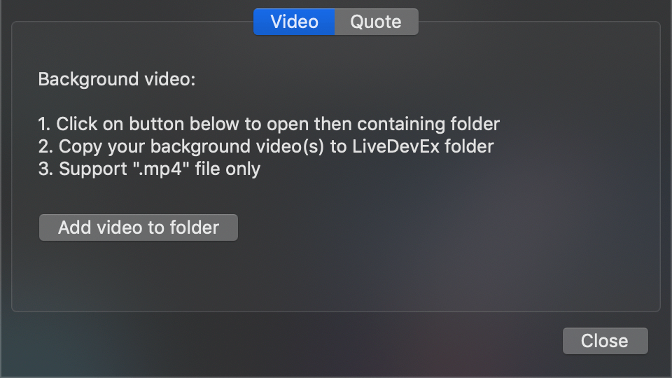
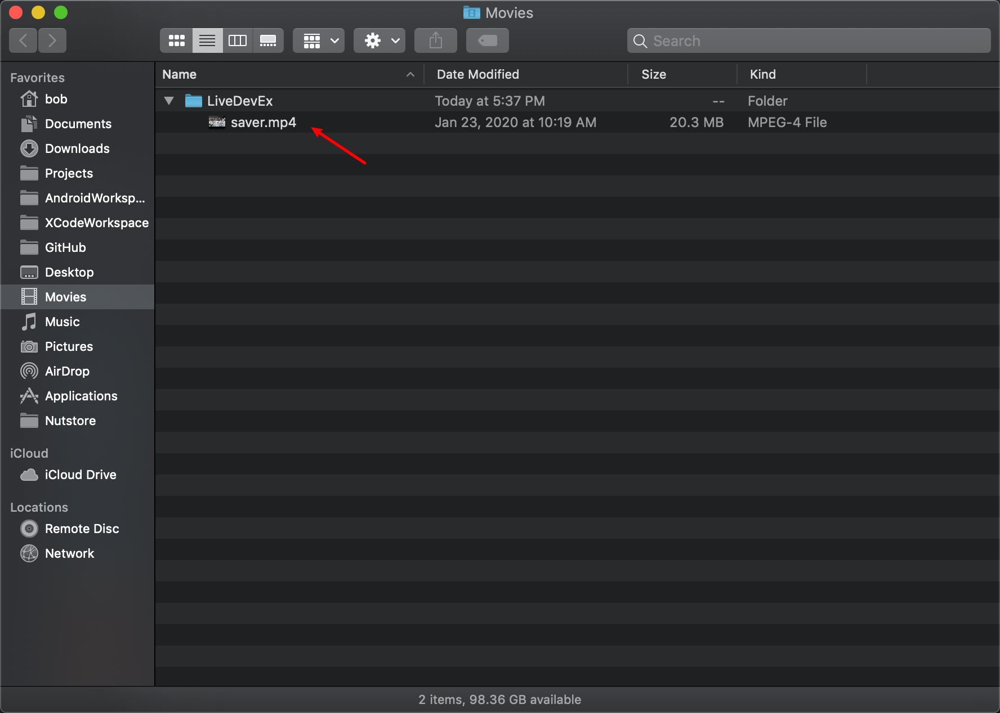

# LiveDeveloperExcuses.saver

**Developer excuses screensaver with video background.**

⬆️Click to view the video on Youtube.

**Or have a dream of Electric Sheep**

***LiveDeveloperExcuses*** is  a screensaver which periodically shows a quote from [http://developerexcuses.com](http://developerexcuses.com), with optional video background support.

Not officially affiliated with [http://developerexcuses.com](http://developerexcuses.com)

## Install

### Download

Grab the latest [release here](https://github.com/SpongeBobSun/LiveDeveloperExcuses/releases)!

### Install

Since I haven't figure out how to sign a screensaver properly, you might suffer some minor signing issues.

After unzipped the latest release, you need to right-click the `.saver` file then choose open instead of double-click it. Then you need to click on the open button in following popup dialog.

## Set a video background

1. Open "System Preference.app" and navigate to the "Desktop & Screensaver" panel.

2. Check "LiveDeveloperExcuses" screensaver then click the "Screensaver Options" button.

3. Click "Add video to folder" button

4. Copy your video into "Movies/LiveDevEx" folder

5. Enjoy.

## Where can I get a decent video background?

There are a lot of royalty-free video sites. 

I recommend [Pixabay](https://pixabay.com/videos/) and [Visualdon](https://visualdon.uk/).

### Powered by  [OnelinerKit](https://github.com/kimar/OnelinerKit) and [DeveloperExcueses](https://github.com/kimar/DeveloperExcuses)

And feel free to fork and contribute ;-)

## Getting started

Open up *LiveDeveloperExcuses.xcodeproj* using Xcode and hit Cmd+B to build it. That's it.

## Road map & Todo

- [x] Shuffle in multiple videos
- [x] Quote fetching interval
- [ ] Font & background style for quote text
- [ ] Quote text position

## License

See [LICENSE.md](LICENSE.md)
